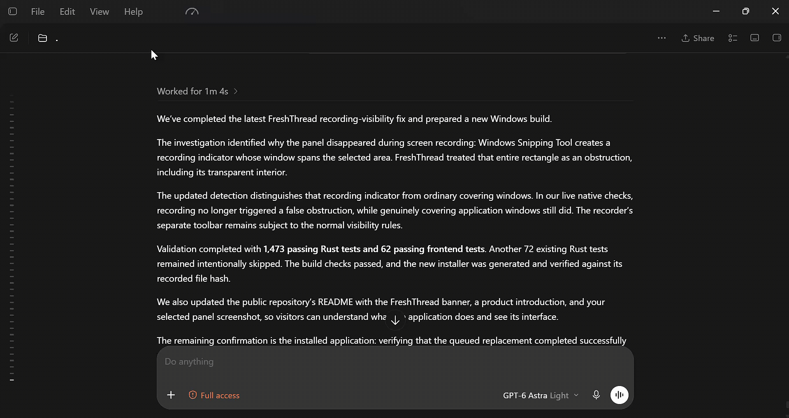

**FreshThread is a Windows companion for Codex that shows task activity and helps
you continue in a fresh task with your working context.**

**[Download for Windows beta (x64)](https://github.com/GG95-lab/FreshThread-BETA-version/releases/download/v0.2.6-beta.3/FreshThread_0.2.6-beta.3_x64-setup.exe)**

Its panel shows available context usage, completed turns, compactions and handoff
readiness. A handoff summarizes your goal, constraints, completed work and next
steps. You review and approve it before moving to a new task.

## Reading the panel

The panel updates live as you work, following the selected session as Codex
reports new activity and measurements.

### Size & context

| Indicator | What it tells you |
| :--- | :--- |
| **MiB** | **Accumulated size on disk** of this session's data, as last read. |
| **Session pressure** | **Overall session pressure**, expressed as a status. |
| **Last compaction** | Context usage **before → after** the latest compression. The right-hand value is the starting load for continued work. |
| **Context load** | **Current context occupancy**, as last measured. |

> **88.5% → 17.1%** means work resumed with **17.1%** of the context already
> occupied. A higher starting value leaves less room for new work.
> As the session grows, the model may also carry forward more details that are
> no longer useful to the current task.

### Session activity

| Counter | What it counts |
| :--- | :--- |
| **Compactions** | Recorded context compressions in this session. |
| **Completed turns** | Completed response cycles. Each can include several tool calls. |
| **Interrupted** | Response cycles recorded as interrupted, such as a stopped response. |
| **Token use** | Recorded token usage across completed and interrupted turns—not just the current context. |

### Continuing in a new task

| Status | What it tells you |
| :--- | :--- |
| **Handoff** | Whether the working context is ready to carry into a new task. **You choose when to start.** |

---

**Jump to:** [Beta status](#beta-status) · [Getting started](#getting-started) ·
[What to test](#what-to-test) · [Report a problem](#report-a-problem) ·
[Your data](#your-data) · [Updates](#updates)

## Beta status

**The seven-day public beta is available.** Download the Windows x64 installer
from this repository's [Releases](https://github.com/GG95-lab/FreshThread-BETA-version/releases).
The source code remains private.

The beta runs for **7 days from its release date**, with the same deadline
for everyone. Installing a patch will not extend it. No FreshThread account is
required. The deadline works offline using the local clock; after expiry, user
data, bug reporting and updates remain available.

The beta runs from **September 24, 2026 at 11:00** to **October 1, 2026 at
11:00 Budapest time**. The beta has no participant limit.

## Getting started

1. [Download the Windows x64 installer](https://github.com/GG95-lab/FreshThread-BETA-version/releases/download/v0.2.6-beta.3/FreshThread_0.2.6-beta.3_x64-setup.exe).
2. Install it in the Windows account where you use Codex.
3. 💡 If Codex was open during installation, fully exit through
   **File → Quit ChatGPT**, then restart Codex. Closing only the window may leave
   Codex running.
4. Enable the FreshThread hooks in **Settings → Hooks**.
5. Open the FreshThread panel to view task activity or start a handoff.

The installer has no Windows publisher signature (Authenticode),
so Windows may show an unknown-publisher warning. Do not disable Windows
protection. Automatic updates require separate signature verification; a
download hash alone does not prove who published a file.

The release includes [SHA256SUMS.txt](https://github.com/GG95-lab/FreshThread-BETA-version/releases/download/v0.2.6-beta.3/SHA256SUMS.txt)
for checking the installer's hash and a
[GitHub release attestation](https://docs.github.com/en/code-security/how-tos/secure-your-supply-chain/secure-your-dependencies/verify-release-integrity)
for verifying that the installer belongs to this release.
On a successful uninstall, FreshThread removes its Codex integration and restores
the Codex settings it changed, leaving unrelated settings in place.

## What to test

- Startup and hook setup.
- Tasks opened from Projects and Recents, task switching and empty tasks.
- Panel placement and proportions across resolutions and Windows scaling.
- Measurements after a completed turn, and handoffs using a disposable task
  without private content.
- Whether updates preserve settings and hooks. Avoid deliberately interrupting
  installation on your everyday computer.

Check release notes for known limitations. Report unexpected behavior even if
you find a workaround.

## Report a problem

In the beta, open **FreshThread tray menu → Report a bug**. Review the diagnostic
preview, optionally describe the problem, then choose **Send report** for a
private report. No account is needed, and nothing is uploaded until you send it.

Prefer GitHub? **Copy diagnostics** and **Report on GitHub** remain available.
GitHub issues are public and require a GitHub account. Search existing issues,
then use **Issues → New issue → Bug report**. Include:

- FreshThread build, Codex version, Windows version and display scaling.
- Steps to reproduce the problem.
- What you expected and what happened.

Issues are public. Remove private information from screenshots and optional
diagnostics. Never upload conversations, databases, credentials, account
identifiers or raw diagnostic folders.

Report security vulnerabilities through
[private reporting](https://github.com/GG95-lab/FreshThread-BETA-version/security/advisories/new),
not public issues.

## Your data

FreshThread reads Codex's local session files to show task activity. It writes
checkpoints and diagnostics in its own local app folder and installs its
integration and hooks in Codex. Diagnostic reports do not include conversation
text by default; review the preview and your optional description before sending.

FreshThread contacts GitHub to check for updates. It sends a diagnostic report
only when you review the preview and select **Send report**; your optional
description is included, and the report is retained for up to 30 days. Handoffs
run through Codex, so model-based preparation may use Codex's model provider.
The beta deadline is checked locally.

## Updates

Beta installations check for signed updates at startup and every 15 minutes;
installation waits for a safe pause in Codex work. New beta releases also
appear under [Releases](https://github.com/GG95-lab/FreshThread-BETA-version/releases).
A patch does not restart the seven-day deadline.
