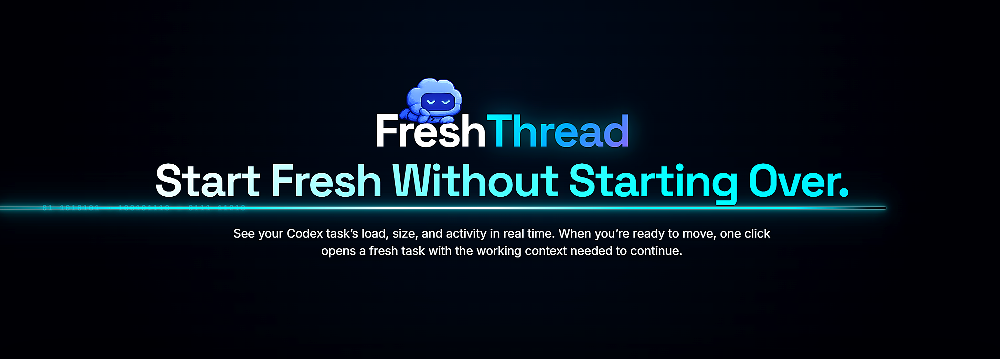
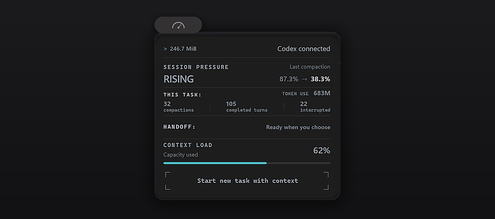

# FreshThread BETA version

**FreshThread is a Windows companion for Codex that helps you follow long tasks
and carry their working context into a fresh task.**

Long conversations accumulate decisions, constraints and unfinished work. When
you need to continue in a new task, reconstructing that context manually can be
time-consuming. FreshThread prepares a handoff summary for you to review before
you approve the transition.

## What FreshThread does

- **Shows session information beside Codex.** A compact indicator and expandable
  panel show available context usage, completed turns, compactions and handoff
  readiness for the selected task.
- **Prepares task continuity.** It collects the available working-state summary,
  including the goal, constraints, completed work and next steps, for a handoff.
- **Keeps the decision with you.** Preparing a handoff does not authorize it.
  You review and approve the handoff before execution.
- **Works with your Windows setup.** The panel is designed to preserve its
  proportions across display scaling and resolution changes. Different setups
  are part of this public beta's testing scope.

FreshThread does not increase the model's context limit or guarantee that every
detail of a conversation will transfer. Some measurements depend on information
available from Codex; missing values are shown as unavailable, not invented.
Always review the handoff summary, especially for sensitive or important work.

## How you use it

Install FreshThread in the Windows account where you use Codex, review its hooks
in Codex, and continue working normally. Open the FreshThread panel to inspect
the current task's available measurements. When you want a fresh task, review
the prepared handoff and approve it if it captures what you need to continue.

## About this beta

This repository distributes FreshThread installers and collects feedback. The
application source is maintained separately. No public beta installer has been
published yet.

The planned public beta lasts **10 days from its announced launch**. Exact start
and end dates will appear with the first beta release. This is a feedback period,
not an automatic application expiry. There is no invitation or tester-count limit.

## Before installing

- Use the Windows x64 installer attached to a release in this repository.
- The initial beta has no Windows Authenticode signature. Windows may display
  an unknown-publisher warning. Do not disable Windows protection globally.
- Update signatures and Windows publisher signatures are different. Automatic
  updates must be verified by FreshThread's embedded updater public key. A hash
  posted next to a download alone does not prove publisher authenticity.
- Back up your work and any existing FreshThread data privately before testing.
  Do not move FreshThread databases between Windows users.

## What to test

1. Install in the Windows account where you use Codex. Check startup and the
   initial hook setup; approve FreshThread hooks in Codex yourself.
2. Open tasks from Projects and Recents, switch tasks, and open an empty task.
3. Check panel placement with your normal Windows scaling, resolution and pet.
4. Complete a turn, review the available measurements, then try an approved
   handoff using a disposable task without private content.
5. When a new beta is released, check that updating preserves settings and hooks.
   Do not deliberately interrupt installation on your daily working environment.

Report unexpected behavior even if you found a workaround. Missing measurements
are not zero measurements. The release notes list known limitations.

## Report a problem

Open this repository's **Issues → New issue → Bug report**. Include the exact
FreshThread version/build, Codex version, Windows version/scaling, reproduction
steps, expected behavior and actual behavior. Search for existing reports first.

Issues are public. Never attach conversations, databases, credentials, account
identifiers or raw diagnostic folders. Review and redact screenshots before
posting. Diagnostics are optional and must be inspected before sharing.

For a suspected security vulnerability, use
[private reporting](https://github.com/GG95-lab/FreshThread-BETA-version/security/advisories/new).
Do not publish exploit details or secrets in a normal issue.

## Updates and the end of the beta

Beta updates will use a beta-only feed. Stable users must not receive beta builds
implicitly. Feed provisioning and signed-update acceptance are launch gates;
this document does not claim that the service is already running.

At the end of day 10, we will summarize confirmed problems and decide whether to
release a stable version or extend the beta. Open issues will remain visible.
There is no promised stable-release date and no automatic deletion of user data.

Windows uninstall removes FreshThread's owned integration and local application
data. Keep any needed private backup before uninstalling. Database schema changes
mean that installing an older executable alone is not a supported rollback.
