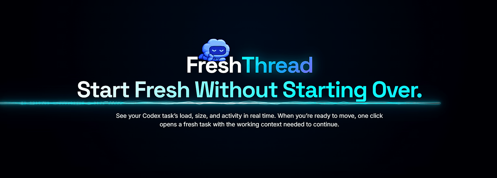
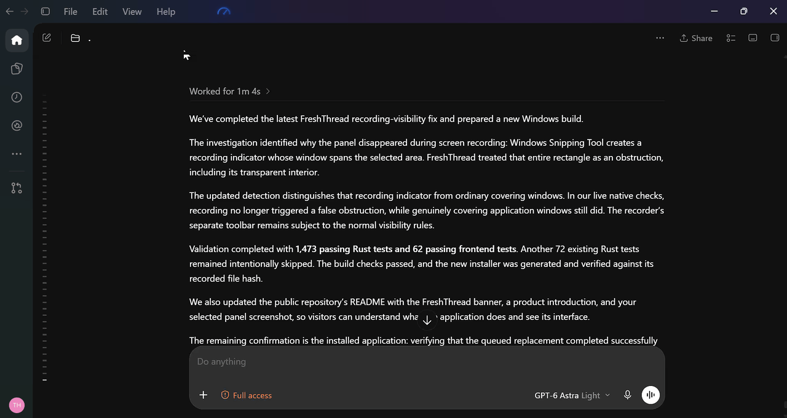
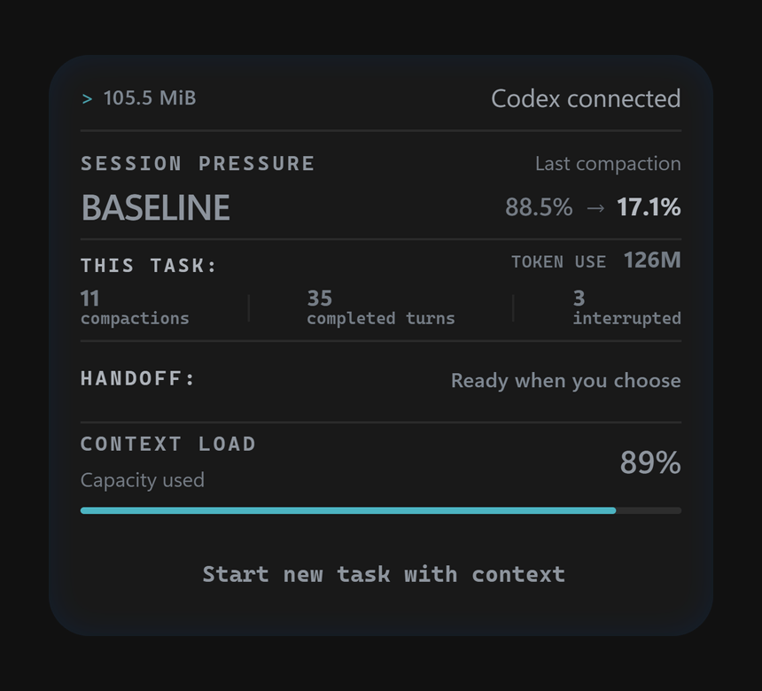
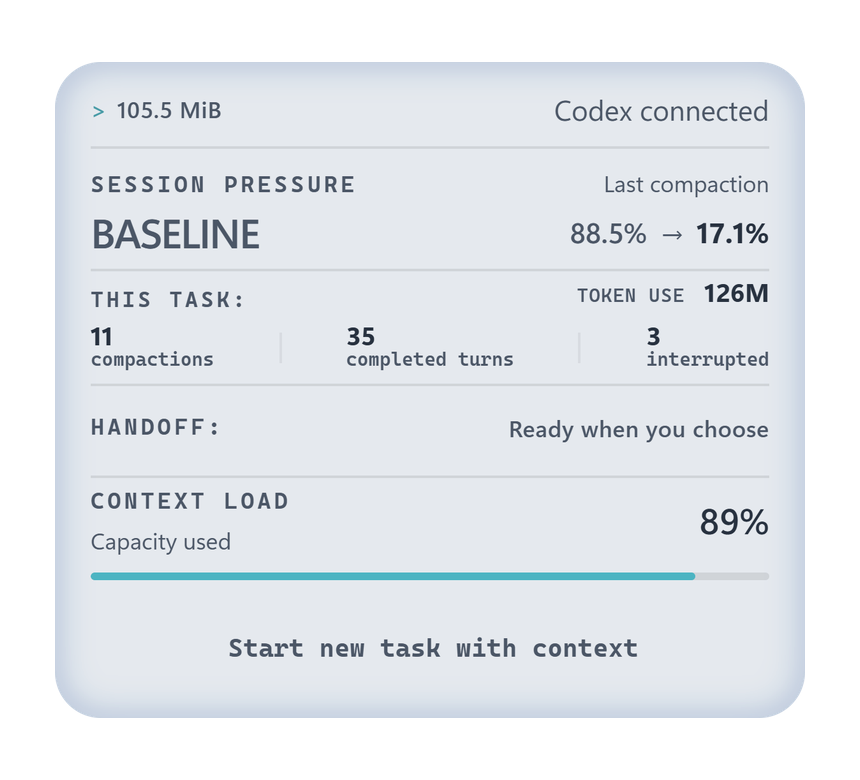

**Long Codex sessions can degrade after repeated compactions.**
FreshThread helps you see when a session is getting overloaded and move the important context into a fresh task without starting over.

**Before:** in a 372-turn session, Codex got stuck on one fix and kept repeating failed attempts. 
**After handoff:** the same fix, in a fresh task that already knew the context, worked on the first try.

**FreshThread is a Windows companion for Codex that shows task activity and helps
you continue in a fresh task with your working context.**

**[Download for Windows beta (x64)](https://github.com/GG95-lab/FreshThread-BETA-version/releases/download/v0.2.6-beta.17/FreshThread_0.2.6-beta.17_x64-setup.exe)**

**Verify your download:** The [Beta 17 release notes](https://github.com/GG95-lab/FreshThread-BETA-version/releases/tag/v0.2.6-beta.17)
show how to check the installer against GitHub's immutable release. The
[bridge and network viewer each have build verification](https://github.com/GG95-lab/FreshThread-bridge/blob/main/VERIFY.md).

> 💡 **Windows installer:** This beta is not yet signed with a Windows publisher
> certificate. Windows may show an **“Unknown publisher”** warning when you run it.

Its panel shows available context usage, completed turns, compactions and handoff
readiness. A handoff summarizes your goal, constraints, completed work and next
steps. You review and approve it before moving to a new task.

## Privacy in short

- **Runs on your computer.** FreshThread reads Codex's session files locally to
  show the measurements and keeps its own data in a local app folder. No account
  needed.
- **Goes online for two things only:** checking GitHub for updates, and sending a
  bug report when you click **Send report**. Handoffs run through Codex itself,
  and a handoff summary can include text you wrote.
- **Bug reports stay in your hands.** You see the full report before sending. It
  has no conversation text by default and is kept for up to 30 days.
- **The Codex connection is open source.** The current installer routes
  Codex hooks and MCP through the [FreshThread bridge](https://github.com/GG95-lab/FreshThread-bridge).
  You can review what it passes to the private app and [verify the installed
  bridge binary](https://github.com/GG95-lab/FreshThread-bridge/blob/main/VERIFY.md)
  against its public release and build attestation.
- **See network activity yourself.** Open **Network activity…** from the
  FreshThread tray menu. A separate open-source viewer shows connections Windows
  reports for FreshThread and related programs. It watches only while open and
  unpaused, and saves or uploads nothing. Very short connections can be missed.
  [Read how it works and verify your copy](https://github.com/GG95-lab/FreshThread-bridge/blob/main/NETWORK.md).

## Reading the panel

The panel updates live as you work, following the selected session as Codex
reports new activity and measurements.
It follows Codex's light or dark appearance, with the same layout in both modes.

### Size & context

| Indicator | What it tells you |
| :--- | :--- |
| **MiB** | **Accumulated size on disk** of this session's data, as last read. |
| **Session pressure** | **Overall session pressure**, expressed as a status. |
| **Last compaction** | Context usage **before → after** the latest compression. The right-hand value is the starting load for continued work. |
| **Context load** | **Current context occupancy**, as last measured. |

> **93.6% → 32.3%** means work resumed with **32.3%** of the context already
> occupied. A higher starting value leaves less room for new work.
> As the session grows, the model may also carry forward more details that are
> no longer useful to the current task.

### Session activity

| Counter | What it counts |
| :--- | :--- |
| **Compactions** | Recorded context compressions in this session. |
| **Completed turns** | Completed response cycles. Each can include several tool calls. |
| **Interrupted** | Response cycles recorded as interrupted, such as a stopped response. |
| **Token use** | Recorded token usage across completed and interrupted turns—not just the current context. |

### Continuing in a new task

| Status | What it tells you |
| :--- | :--- |
| **Handoff** | Whether the working context is ready to carry into a new task. **You choose when to start.** |

  
  

The panel follows your Codex appearance setting: light, dark, or your system theme.

---

<strong>Beta status</strong>

**The seven-day public beta is available.** Download the Windows x64 installer
from this repository's [Releases](https://github.com/GG95-lab/FreshThread-BETA-version/releases).
The main app's source code remains private. Its newer Codex connection is open
source: [FreshThread bridge](https://github.com/GG95-lab/FreshThread-bridge).

The beta runs for **7 days from its release date**, with the same deadline
for everyone. Installing a patch will not extend it. No FreshThread account is
required. The deadline works offline using the local clock; after expiry, user
data, bug reporting and updates remain available.

The beta runs from **September 24, 2026 at 11:00** to **October 1, 2026 at
11:00 Budapest time**. The beta has no participant limit.

<strong>Getting started</strong>

1. [Download the Windows x64 installer](https://github.com/GG95-lab/FreshThread-BETA-version/releases/download/v0.2.6-beta.17/FreshThread_0.2.6-beta.17_x64-setup.exe).
2. Install it in the Windows account where you use Codex.
3. Review and enable the FreshThread hooks in **Codex Settings → Hooks**.
4. Open the FreshThread panel to view task activity or start a handoff.

Use local Windows tasks in the Codex MSIX app. WSL and remote tasks are not
supported by this build. Installation needs internet access if WebView2 is
missing, and administrator policies must permit the app and its hooks. If you
use `CODEX_HOME`, FreshThread and Codex must receive the same absolute path.
Beta 17 changes the hook definition, so Codex may ask you to review it again.

Automatic updates require separate signature verification; a download hash
alone does not prove who published a file.

The release includes [SHA256SUMS.txt](https://github.com/GG95-lab/FreshThread-BETA-version/releases/download/v0.2.6-beta.17/SHA256SUMS.txt)
for checking the installer's hash and an updater signature. You can also
[verify the installer against GitHub's immutable release](https://github.com/GG95-lab/FreshThread-BETA-version/releases/tag/v0.2.6-beta.17).
The separate public bridge and network viewer each have a
[build attestation and verification instructions](https://github.com/GG95-lab/FreshThread-bridge/blob/main/VERIFY.md).
On a successful uninstall, FreshThread removes its Codex integration and restores
the Codex settings it changed, leaving unrelated settings in place.

<strong>What to test</strong>

- Startup and hook setup.
- Tasks opened from Projects and Recents, task switching and empty tasks.
- Panel placement and proportions across resolutions and Windows scaling.
- Measurements after a completed turn, and handoffs using a disposable task
  without private content.
- Whether updates preserve settings and hooks. Avoid deliberately interrupting
  installation on your everyday computer.

Check release notes for known limitations. Report unexpected behavior even if
you find a workaround.

<strong>Report a problem</strong>

In the beta, open **FreshThread tray menu → Report a bug**. Review the diagnostic
preview, optionally describe the problem, then choose **Send report** for a
private report. No account is needed, and nothing is uploaded until you send it.

Prefer GitHub? **Copy diagnostics** and **Report on GitHub** remain available.
GitHub issues are public and require a GitHub account. Search existing issues,
then use **Issues → New issue → Bug report**. Include:

- FreshThread build, Codex version, Windows version and display scaling.
- Steps to reproduce the problem.
- What you expected and what happened.

Issues are public. Remove private information from screenshots and optional
diagnostics. Never upload conversations, databases, credentials, account
identifiers or raw diagnostic folders.

Report security vulnerabilities through
[private reporting](https://github.com/GG95-lab/FreshThread-BETA-version/security/advisories/new),
not public issues.

<strong>Updates</strong>

Beta installations check for signed updates at startup and every 15 minutes;
installation waits for a safe pause in Codex work. New beta releases also
appear under [Releases](https://github.com/GG95-lab/FreshThread-BETA-version/releases).
A patch does not restart the seven-day deadline.

Upgrading from beta.6 or earlier needs one Codex restart to load the new bridge.
After that, compatible app updates can reconnect in the background while Codex
stays open. FreshThread confirms when the updated connection is ready.

---

FreshThread is an independent tool for OpenAI Codex, not made or endorsed by OpenAI. 
The Codex pet belongs to OpenAI and only shows that FreshThread works with Codex.
